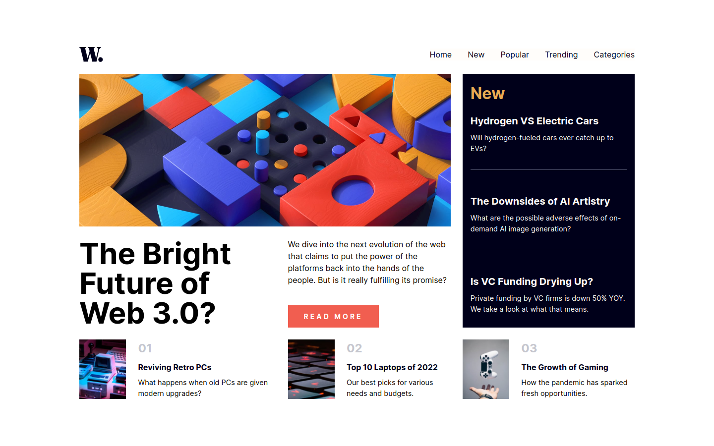

# Frontend Mentor - News Homepage solution

This is a solution to the [News Homepage challenge on Frontend Mentor](https://www.frontendmentor.io/challenges/news-homepage-H6SWTa1MFl). Frontend Mentor challenges help you improve your coding skills by building realistic projects.

## Table of contents

- [Overview](#overview)
  - [The challenge](#the-challenge)
  - [Screenshot](#screenshot)
  - [Links](#links)
- [My process](#my-process)
  - [Built with](#built-with)
  - [What I learned](#what-i-learned)
  - [Continued development](#continued-development)
- [Author](#author)

## Overview

### The challenge

Users should be able to:

- View the optimal layout for the interface depending on their device's screen size
- See hover and focus states for all interactive elements on the page
- **Bonus**: Toggle the mobile menu (requires some JavaScript)

### Screenshot



### Links

- Repository URL: [Github](https://github.com/johnv2309/news-homepage-challenge)
- Solution URL: [Frontend Mentor](https://www.frontendmentor.io/solutions/news-homepage-with-react-sass-and-vite-q1lCIza5zK)
- Live Site URL: [Netlify](https://johnv2309-news-homepage-challenge.netlify.app/)

## My process

### Built with

- Semantic HTML5 markup
- [Sass](https://sass-lang.com/)
- Flexbox
- Mobile-first workflow
- [React](https://reactjs.org/) - JS library
- CSS Modules

### What I learned

My first project using React and Sass (with CSS Modules) for fundamentals learning purposes.

```css
/* Used to make the responsive navigation slide from right to left */
.header__nav {
  transform: scale(0, 0);
  transform-origin: right;
}

.header__nav .active {
  transform: scale(1, 1);
}
```

### Continued development

I'll continue developing this project to implement React Router to add functionality to the pages listed in the navigation.

## Author

- Github - [@johnv2309](https://github.com/johnv2309)
- Frontend Mentor - [@johnv2309](https://www.frontendmentor.io/profile/johnv2309)
